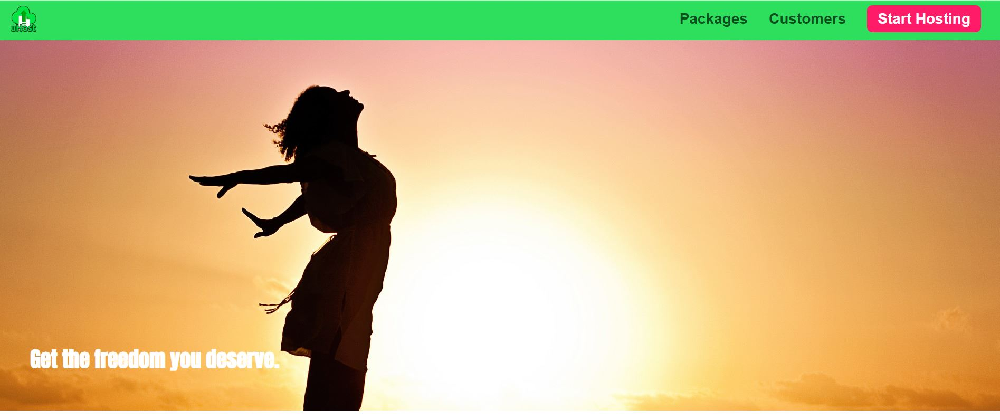
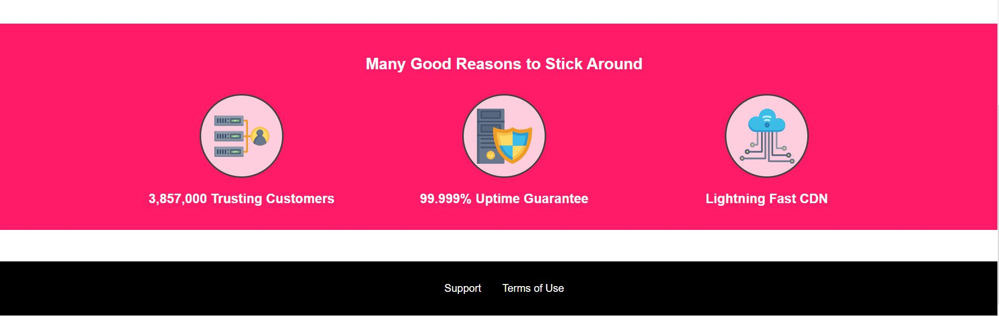
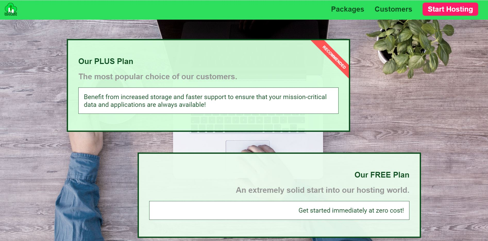
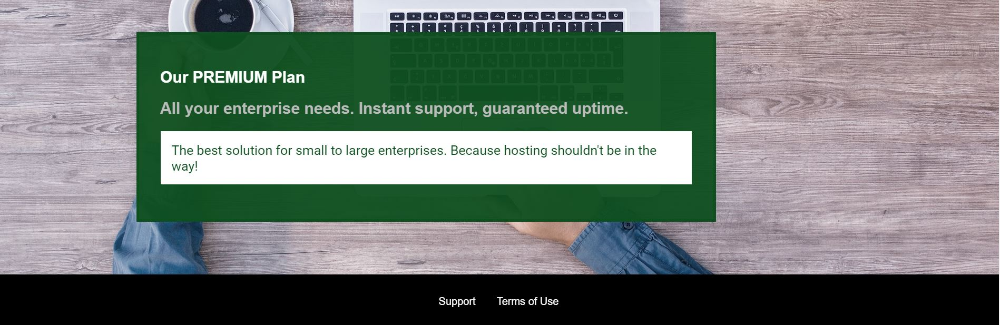
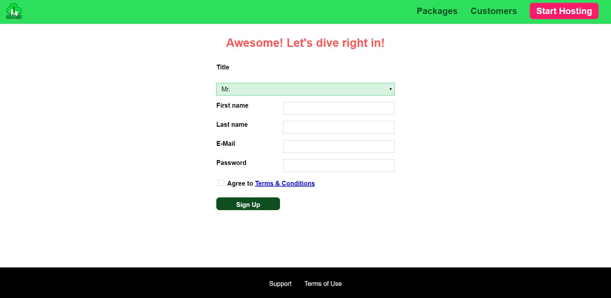

# css-boot-camp

## Responsive Static website implemented with Plain HTML, CSS and Javascript

## Used Grid, Flex, Sass.

## Few screenshots of the website is below:

## Home Page

## Packages Page

## Start Hosting Page

